<div align="center">



</div>

<div align="center">

[](https://git.io/typing-svg)


</div>

---

## 🚀 Sobre mí

```typescript
const matias = {
    ubicacion: "Argentina 🇦🇷",
    rol: "Full Stack Developer",
    lenguajes: ["TypeScript", "JavaScript", "SQL"],
    tecnologias: {
        frontend: ["React", "HTML5", "CSS3"],
        backend: ["Node.js", "Express"],
        databases: ["PostgreSQL", "SQL"],
        tools: ["Git", "GitHub", "VS Code", "npm"]
    },
    intereses: ["Desarrollo Web", "Arquitectura de Software", "Clean Code"],
    aprendiendo: "Constantemente mejorando mis skills 📚",
    frase: "El código es poesía en movimiento 💚"
};
```

---

## 💻 Tech Stack

<div align="center">

### Lenguajes


### Frontend


### Backend


### Tools & Platforms


</div>

---

## 📊 GitHub Stats

<div align="center">
  


</div>

<div align="center">

[](https://git.io/streak-stats)

</div>

<div align="center">


</div>

---

## 🎯 Proyectos Destacados

<div align="center">

<a href="https://github.com/matiasgzlez/MiFacu">
  
</a>

<a href="https://github.com/matiasgzlez/AutoDiagnosticoVUCAK2solutions">
  
</a>

<a href="https://github.com/matiasgzlez/basededatos2025">
  
</a>

</div>

### 📚 MiFacu
> Sistema educativo completo desarrollado en TypeScript para gestión académica.

**Tecnologías:** TypeScript, React, Node.js

---

### 📊 AutoDiagnóstico VUCA
> Herramienta empresarial para análisis de entornos VUCA (Volatilidad, Incertidumbre, Complejidad y Ambigüedad).

**Tecnologías:** TypeScript, Analytics Dashboard

---

### 🗄️ Base de Datos 2025
> Proyecto de diseño e implementación de bases de datos relacionales con SQL avanzado.

**Tecnologías:** SQL, PostgreSQL, Database Design

---

## 🏆 GitHub Trophies

<div align="center">

[](https://github.com/ryo-ma/github-profile-trophy)

</div>

---

## 📈 Contribuciones

<div align="center">


</div>

---

## 💡 Lo que estoy haciendo

```javascript
while (alive) {
    eat();
    sleep();
    code();
    repeat();
}
```

- 🔭 Trabajando en proyectos de **TypeScript** y **React**
- 🌱 Aprendiendo **arquitecturas escalables** y **clean code**
- 💬 Preguntame sobre **JavaScript, TypeScript, React, Node.js**
- ⚡ Fun fact: **Debuggear es como ser un detective en una película de crimen**

---

## 📫 Conectemos

<div align="center">

[](https://github.com/matiasgzlez)
[](https://linkedin.com/in/tu-perfil)
[](mailto:tu-email@ejemplo.com)
[](https://tu-portfolio.com)

</div>

---

<div align="center">

### 💭 Quote del día


---

### 🎵 Coding Soundtrack


---


**⭐ Si te gusta mi trabajo, no olvides dejar una estrella en mis repos! ⭐**

</div>